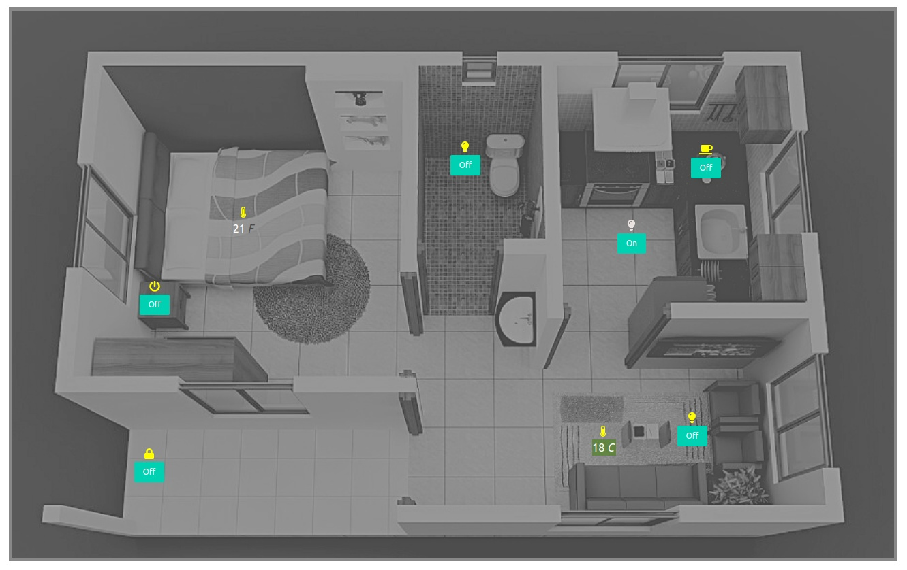
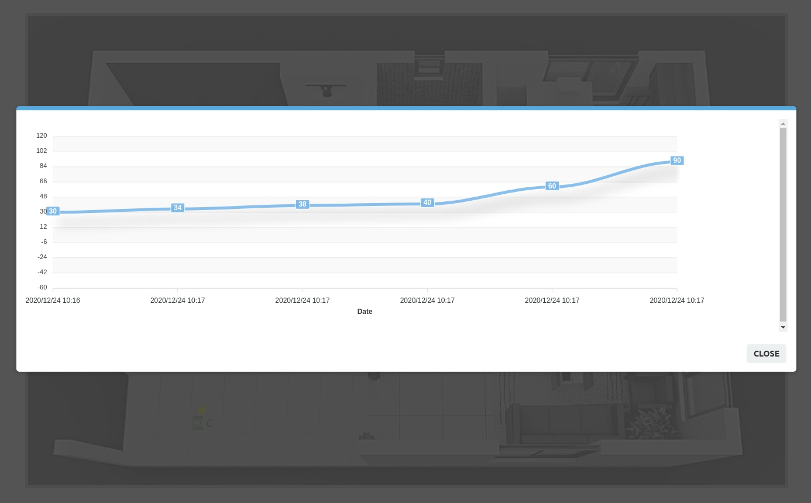

# appi2c
MQTT device administrator

Technology.
  - Flask
  - Sqlite
  - SQLAlchemy
  - Python
  - Bulma
  - Socket.IO
  - jquery-confirm, jquery-UI, jquery Finger, Ajax
  - ApexChart
  - MQTT
  - bot Telegram

### What does it really do?
Register your MQTT Brokers, register your mqtt devices can be sensors or actuators.
Distribute your devices in groups and manage information in real time.
Drag and position the representation of your devices on a blue print,
click on them to publish commands, double-click and follow the information.




### Installation

Clone the project.
```sh
git clone https://github.com/andrequeiroz2/appi2c.git
```
Install and activate virtulenv
```sh
$ cd appi2c
$ pip install virtualenv
$ virtualenv env
$ source env/bin/activate
```
Insttal requeriments
```sh
$ (env) pip install -r requirements.txt 
```
Starting Data Base and Populate tables
```sh
$ (env) cd appi2c
$ (env) flask populate-type
$ (env) flask populate-icon
```
Run appi2c
```sh
$ (env) flask run
```

### Todos

 - More Tests.
 - Add new type devices.
 - Triggers.
 - Alert.
 - etc..

License
----

MIT


**Free Software, Hell Yeah!**
